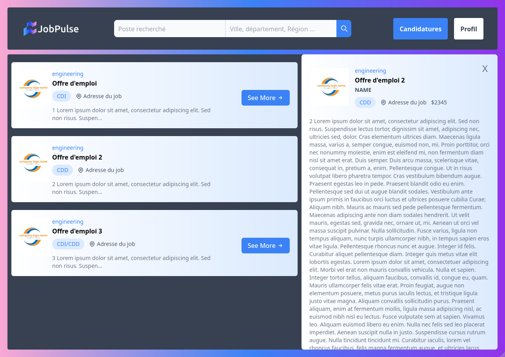

<h1 align="center">
  <br>
  
  <br>
  TWEB-501
  <br>
  Job Board
  <br>
</h1>

<p align="center">
  <a href="https://badge.fury.io/js/electron-markdownify">
    
  </a>
  <a href="https://saythanks.io/to/bullredeyes@gmail.com">
      
  </a>
    <a href="https://saythanks.io/to/bullredeyes@gmail.com">
      
  </a>
</p>

<p align="center">
  <a href="#how-to-use">How To Use</a>
</p>

<p >
  
</p>

## How To Use

To clone and run this application, you'll need [Git](https://git-scm.com) and [Flask](https://pypi.org/project/Flask/) installed on your computer. From your command line:

```bash
# Clone this repository
$ git clone https://github.com/EpitechMscProPromo2026/T-WEB-501-LIL_11.git

# Go into the repository
$ cd T-WEB-501-LIL_11

# Install dependencies
$ pip install Flask
$ pip install -U Flask-SQLAlchemy
$ pip install Flask-Login
$ pip install --force-reinstall -v "werkzeug==2.3"

# Run the app
$ export FLASK_APP=run.py
$ flask run
```

Now you can use our site at the url shown in your terminal

---

> GitHub [Doussinet Martin](https://github.com/MDoussinet) &nbsp;&middot;&nbsp;
> GitHub [Gelles Julien](https://github.com/Julien-Gelles-Epitech)
